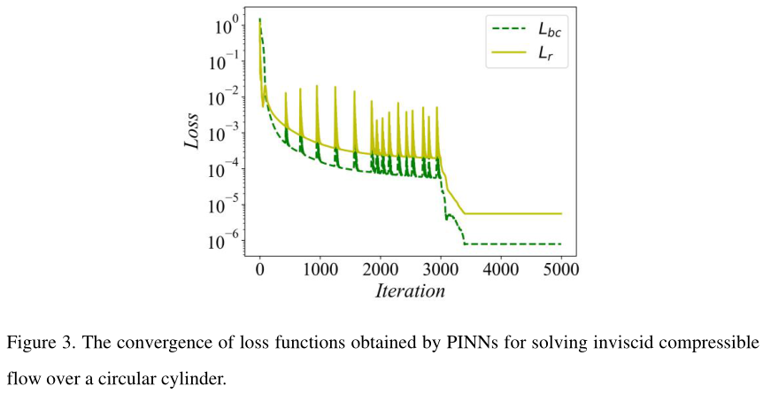
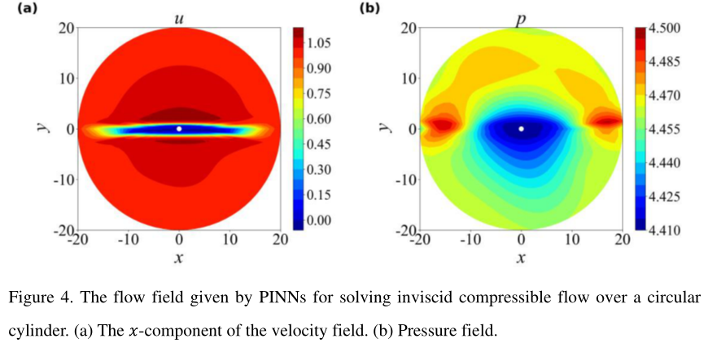
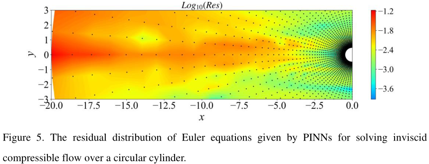
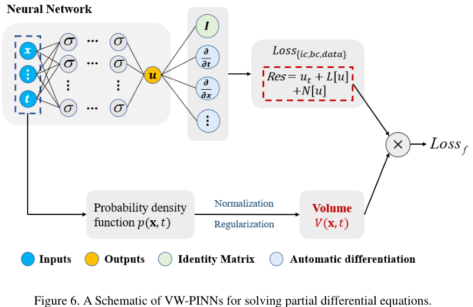

# ***VW-PINNs***: A Volume Weighting Method for *PDE* Residuals in Physics-Informed Neural Networks

## Abstract·摘要

> **Physics-Informed Neural Networks (PINNs)** have shown remarkable prospects in the solving the forward and inverse problems involving *Partial Differential Equations (PDEs)*.
> The method embeds *PDEs* into the neural network by calculating *PDE* loss at a series of collocation points, providing advantages such as meshfree and more convenient adaptive sampling.
> However, when solving *PDEs* using nonuniform collocation points, **PINNs** still face challenge regarding inefficient convergence of *PDE* residuals or even failure.
> In this work, we first analyze the ill-conditioning of the *PDE* loss in **PINNs** under nonuniform collocation points.
> To address the issue, we define volume-weighted residual and propose ***Volume-Weighted Physics-Informed Neural Networks (VW-PINNs)***.
> Through weighting the *PDE* residuals by the volume that the collocation points occupy within the computational domain, we embed explicitly the spatial distribution characteristics of collocation points in the residual evaluation.
> The fast and sufficient convergence of the *PDE* residuals for the problems involving nonuniform collocation points is guaranteed.
> Considering the meshfree characteristics of ***VW-PINNs***, we also develop a volume approximation algorithm based on kernel density estimation to calculate the volume of the collocation points.
> We verify the universality of ***VW-PINNs*** by solving the forward problems involving flow over a circular cylinder and flow over the NACA0012 airfoil under different inflow conditions, where conventional **PINNs** fail; 
> By solving the **Burgers' Equation**, we verify that ***VW-PINNs*** can enhance the efficiency of existing the adaptive sampling method in solving the forward problem by 3 times, and can reduce the relative error of conventional **PINNs** in solving the inverse problem by more than one order of magnitude. 

**物理信息神经网络 (Physics-Informed Neural Networks, PINNs)** 已经在求解*偏微分方程 (Partial Differential Equations, PDEs)* 的正问题和反问题方面取得了令人瞩目的成果.
该方法通过在一系列配置点上计算 *PDE* 残差将 *PDEs* 嵌入到神经网络, 从而提供了如无网格要求和更方便的自适应采样等优点.
然而, 当使用非均匀配置点求解 *PDEs* 时, **PINNs** 仍然面临着计算 *PDE* 残差的不收敛乃至失败的挑战.
本项工作首先分析了 **PINNs** 在非均匀配置点下 *PDE* 损失的病态条件.
为了解决这一问题, 我们定义了体积加权残差, 并提出了***体积加权物理信息神经网络 (Volume-Weighted Physics-Informed Neural Networks,VW-PINNs)***.
通过对 *PDE* 残差用对应样本点在计算域中所占体积加权, 我们显式地将配置点的空间分布特征引入到残差评估中.
对于涉及不均匀配置点的问题, 可以确保 *PDE* 残差能够快速且充分的收敛.
考虑到 **VW-PINNs** 的无网格特性, 我们还开发了基于核密度估计的体积近似算法, 以计算配置点的体积.
考虑具有不同流入条件的圆柱面和 NACA0012 机翼上的流体的正向问题, 传统 **PINNs** 往往会失败, 而我们验证了 ***VW-PINNs*** 的普适性.
通过求解**伯格斯方程 (Burgers' Equation)**, 我们验证了 ***VW-PINNs*** 能够增强现有的自适应采样算法求解正问题的效率, 且有三倍效果. 此外在求解反问题时, 能够比传统 **PINNs** 的相对误差结果好上不止一个数量级.

## 1.Introduction·引言

> In recent years, **Physics-Informed Neural Networks (PINNs)** [1] have became a research hotspot for solving the forward and inverse problems involving *Partial Differential Equations (PDEs)*.
> The central idea of **PINNs** is integrating the governing equations of physical systems into the loss function of neural networks, ensuring that the neural networks minimize *PDE* residuals while approaching the definite conditions or observed data.
> In fact, the concept of **PINNs** can be traced back to the 20th century when Dissanayake et al. [2] pioneered the use of neural networks to solve partial differential equations.
> Compared with mesh-based numerical methods such as **Finite Element (FEM)**, **Finite Difference (FDM)**, and **Finite Volume (FVM)**, the advantage of **PINNs** lies in their ability to directly calculate spatiotemporal derivatives through **Automatic Differentiation (AD)** [3], enabling a meshfree approach that avoids mesh generation, which also indicates that **PINNs** can alleviate the curse of dimensionality to a certain extent [4-5].
> Moreover, **PINNs** can conveniently integrate various observed data for solving the inverse problems, such as inferring velocity and pressure fields based on concentration field and the **Navier-Stokes Equations** [6].
> In contrast, numerical methods demand extremely high cost to achieve the same process.
> **PINNs** have been demonstrated for various physics phenomena, including fluid mechanics [6-9], heat transfer [10-11], fluid-structure interaction [12-13], electromagnetic propagation [14], and quantum chemistry [15]. 

近期, **物理信息神经网络 (Physics-Informed Neural Networks, PINNs)** 已经成为求解涉及*偏微分方程 (Partial Differential Equations, PDEs)* 的正反问题的研究热点.
**PINNs** 的中心思想是将物理系统的控制方程集成到神经网络的损失函数中, 确保神经网络在处理给定条件或观察数据时最小化 *PDE* 残差.
实际上, **PINNs** 的概念可以追溯到 20 世纪, 当 Dissanayake 等人首次提出使用神经网络求解偏微分方程时.
相比基于网格的数值方法, 如**有限元素法 (Finite Element, FEM)**, **有限差分法 (Finite Difference, FDM)**, 和 **有限体积法 (Finite Volume, FVM)**, **PINNs** 的优势在于它们能够通过**自动微分 (Automatic Differentiation, AD)** 直接计算时空导数, 这使得无网格方法成为可能, 这也表明 **PINNs** 可以缓解维数灾难的影响.
此外, **PINNs** 可以方便地集成各种观测数据, 如基于浓度场和**纳维-斯托克斯方程 (Navier-Stokes Equations, NS)** 推断流体速度和压力场.
与此相反, 数值方法则需要极高的成本才能实现相同的过程.
**PINNs** 已经在各种物理现象中得到了验证, 包括流体力学 [6-9], 热传导 [10-11], 介质结构相互作用 [12-13], 电磁传播 [14], 和量子化学 [15].

> Although **PINNs** have achieved gratifying performance, it still faces challenges in terms of accuracy, computational efficiency and training robustness, especially for complex problems [16].
> Therefore, over the past few years, numerous researchers have enhanced **PINNs** in various aspects.
> For example, adaptive activation functions have been designed to improve the convergence of the algorithm [17], and **hp-VPINNs** based on the weak form of *PDE* have been proposed to perform integral transformation on the *PDE* residuals through Legendre basis function [18]. **gPINNs** have been developed to embed gradient information of *PDE* residuals into the loss function [19].
> For complex spatiotemporal problems, the parallel frameworks [20-21] have been built based on spatiotemporal domain decomposition to accelerate the training of **PINNs** and improve the accuracy.
> In order to enhance multi-scale recognition capabilities, **Fourier Feature Network** [22] that scales spatiotemporal coordinates in sinusoidal space and **MscaleDNN** [23] that constructs multi-scale input a priori were developed.
> Furthermore, the gradient pathologies in **PINNs** have been addressed through adaptive weight [24-26] and hard constraints [27-29]. 

尽管 **PINNs** 已经取得了令人满意的性能, 但它仍然面临着精度, 计算效率, 训练鲁棒性等方面的挑战, 特别是复杂问题时.
因此, 在过去的几年, 许多学者在各个方面对 **PINNs** 进行了改进.
例如, 设计自适应激活函数用于提升算法的收敛性, 基于 *PDE* 的弱形式的 **hp-VPINNs** 则通过 Legendre 基函数对 *PDE* 残差进行积分变换, **gPINNs** 则将 *PDE* 残差的梯度信息嵌入到损失函数中.
对于复杂时空问题, 基于时空区域分解建立了并行框架以加速 **PINNs** 训练并提升其精度.
为了增强多尺度识别能力, **傅里叶特征网络 (Fourier Feature Network)** 将时空坐标在正弦空间上进行缩放, 而 **MscaleDNN** 则基于先验构造多尺度输入.
此外, **PINNs** 中的梯度病态问题也被通过自适应权重和硬约束等方式解决.

> In **PINNs**, *PDE* loss is evaluated at a set of scattered collocation points.
> The effect of collocation points on **PINNs** is similar to the effect of mesh points on **FEM**.
> Thus, the location and distribution of these collocation points should be highly important to the performance of **PINNs** [30].
> When the solution of the *PDE* is a simple continuous smooth function, uniform sampling of the collocation points is usually appropriate.
> However, for many practical problems, such as flow over an object and shock wave capture in fluid mechanics.
> The gradients of the solution at the object and shock wave are large, while they are small in other computational regions.
> Thus, refining the collocation points near the object and shock wave to better capture the details of flow while maintaining low-density sampling in other regions can consider both computational cost and accuracy, which is already the consensus for solving such problems by numerical methods.
> At present, although some researches on **PINNs** have paid attention to the importance of nonuniform sampling [30-39], these studies still calculate the mean squared error of *PDE* residuals at all collocation points as *PDE* loss.
> This loss evaluation method overlooks the inconsistent convergence of *PDE* residuals at different locations within the computational domain caused by differences in sampling density.
> Specifically, in the *PDE* loss of **PINNs**, the proportion of *PDE* residuals at all collocation points is equal.
> The reduction of local *PDE* residuals within high-density regions brings greater benefits of loss reduction compared with those within low-density regions when solving problems using nonuniform collocation points.
> The network naturally focuses on reducing the *PDE* residuals in these high-density sampling regions.
> Conversely, the residuals in low-density sampling regions have difficulty converging.
> Consequently, it diminishes the efficiency of **PINNs** and may even lead to failing, especially when there is a significant difference in sampling density.
> We refer to this issue as the ill-conditioning of *PDE* loss function. 

在 **PINNs** 中, *PDE* 损失函数是在散点配置点上评估的.
配置点对 **PINNs** 的影响类似于网格点对 **FEM** 的影响.
因此, 这些配置点的位置和分布对 **PINNs** 的性能至关重要 [30].
当 *PDE* 的解是简单连续光滑函数是, 均匀采样配置点通常是合适的.
然而对于许多实际问题, 例如流体力学中的物体流过和激波捕获, 解在物体和激波处的梯度很大, 而在其他计算区域很小.
因此, 在物体和激波附近加密配置点以更好地捕获流体细节, 同时在其他区域维持低密度采样能够考虑到计算成本和精度, 这已经成为使用数值方法求解这些问题的共识.
目前, 虽然 **PINNs** 的一些研究已经关注到非均匀采样的重要性, 但这些研究仍然在所有配置点上计算 *PDE* 残差的均方误差作为 *PDE* 损失.
这种损失评估方法忽视了计算域中不同位置的不同采样密度导致的 *PDE* 残差不一致收敛性.
具体来说, 在 **PINNs** 的 *PDE* 损失中, 所有配置点的 *PDE* 残差的比例是相同的.
当使用非均匀配置点求解问题时, 高密度区域的局部 *PDE* 残差的减少能够比其他低密度区域会给损失减少带来更大的收益.
网络自然聚焦于减少这些高密度采样区域的 *PDE* 残差.
相反, 低密度采样区域的残差在收敛上存在困难.
因此, 它会降低 **PINNs** 的效率甚至是失败, 特别是在采样密度差异很大时.
我们将这一问题称为 *PDE* 损失函数的病态条件.

> To address the issue, this work defines volume-weighted residual and proposes ***Volume-Weighted Physics-Informed Neural Networks (VW-PINNs)***.
> The *PDE* loss function is re-evaluated by weighting the *PDE* residuals based on the volume occupied by the collocation points within the computational domain.
> To calculate the volume of collocation points in meshfree scenarios such as ***VW-PINNs***, we also develop an efficient volume approximation algorithm based on kernel density estimation [40-41].
> By solving four forward problems and one inverse problem, we verify the advantages of the proposed method in terms of universality, convergence, and accuracy. 

为了解决这一问题, 本项工作定义了体积加权残差, 提出了***体积加权物理信息神经网络 (Volume-Weighted Physics-Informed Neural Networks, VW-PINNs)***.
*PDE* 损失函数通过对 *PDE* 残差用配置点在计算域中所占体积加权后重新评估.
为了在无网格情形下计算配置点的体积, 我们还开发了基于核密度估计的高效体积近似算法.
通过求解四个正问题和一个反问题, 我们验证了所提方法在普适性, 收敛性和精度方面的优势.

> The remainder of the paper is organized as follows.
> In Section 2, we provide a detailed introduction to **PINNs** and analyze the ill-conditioning of the *PDE* loss function in **PINNs**.
> Then, we propose ***VW-PINNs***.
> In Section 3, We carry out a series of numerical experiments to verify the effectiveness of ***VW-PINNs***.
> Concluding remarks and direction for future research are then presented in Section 4. 

本文的后续结构如下 (注: 对原文进行了重排).
第二节提供 **PINNs** 的细节介绍, 并分析了 **PINNs** 中的 *PDE* 损失函数的病态条件.
第三节介绍 ***VW-PINNs***.
第四节进行了一系列数值实验以验证 ***VW-PINNs*** 的有效性.
第五节给出结论和未来的研究方向.

## 2.Related Work·相关工作

### 2.1.Physics-Informed Neural Networks·物理信息神经网络

> Differing from numerical methods, **PINNs** transform solving *PDEs* into an optimization problem. 
> Its input usually involves spatiotemporal coordinates $(\mathbf{x}, t)$ corresponding to the spatiotemporal variables of the PDEs, with the output being the solution $u(\mathbf{x}, t)$. 
> We consider the *PDE* defined on a domain $\Omega\in\mathbb{R}^d$:

和数值方法不同, **PINNs** 将求解 *PDEs* 转化为优化问题.
其输入通常涉及时空坐标 $(\mathbf{x}, t)$, 对应于 *PDEs* 的时空变量, 输出为解 $u(\mathbf{x}, t)$. 
我们考虑在定义在 $\Omega\in\mathbb{R}^d$ 的 *PDE*:

$$
\begin{cases}
    u_t + L[u] +N[u] = 0, &(\mathbf{x},t)\in \Omega\times [0,T], \\
    B[u]=g,&(\mathbf{x},t)\in\partial\Omega\times [0,T],\\
    I[u]=h,&\mathbf{x}\in\Omega,
\end{cases}\tag{1}
$$

> where $u$ denotes the solution of the PDE, $L[\cdot]$ represent the linear differential operator, $N[\cdot]$ represent the nonlinear differential operator, $B[\cdot]$ represent the boundary condition operator.

其中 $u$ 表示 *PDE* 的解, $L[\cdot]$ 表示线性微分算子, $N[\cdot]$ 表示非线性微分算子, $B[\cdot]$ 表示边界条件算子.

> Regrading this problem, the loss function of the **PINNs** is defined as follows:

对于这一问题, **PINNs** 的损失函数定义如下:

$$
    \mathcal{L} = w_{ic} \mathcal{L}_{ic} + w_{bc} \mathcal{L}_{bc} + w_{r} \mathcal{L}_{r} + w_{da} \mathcal{L}_{da},\tag{2}
$$

> where

$$
    \mathcal{L}_{ic} = \dfrac{1}{N_{ic}} \sum_{i=1}^{N_{ic}} |\textcolor{blue}{I[u(\mathbf{x}_{ic}^i,0;\theta)]}-\textcolor{red}{g(\mathbf{x}_{ic}^i)}|^2,\tag{3}
$$

$$
    \mathcal{L}_{bc} = \dfrac{1}{N_{bc}} \sum_{i=1}^{N_{bc}} |\textcolor{blue}{B[u(\mathbf{x}_{bc}^i,t_{bc}^i;\theta)]}-\textcolor{red}{h(\mathbf{x}_{bc}^i, t_{bc}^i)}|^2\tag{4}
$$

$$
    \mathcal{L}_{r} = \dfrac{1}{N_{r}} \sum_{i=1}^{N_{r}} |\textcolor{blue}{u_t(\mathbf{x}_{r}^i, t_{r}^i;\theta)+L[u(\mathbf{x}_{r}^i, t_{r}^i;\theta)]+N[u(\mathbf{x}_{r}^i, t_{r}^i;\theta)]}-\textcolor{red}{0}|^2\tag{5}
$$

$$
    \mathcal{L}_{da} = \dfrac{1}{N_{da}}\sum_{i=1}^{N_{da}} |\textcolor{blue}{u(\mathbf{x}_{da}^i, t_{da}^i;\theta)} - \textcolor{red}{u(\mathbf{x}_{da}^i, t_{da}^i)}|^2\tag{6}
$$

> In Eq.03 ~ Eq.06, $\theta$ represents the network parameters, while $u_\theta = u(\mathbf{x}, t;\theta)$ denotes the solution of **PINNs**.
> $\{\mathbf{x}_{ic}^i,0\}_{i=1}^{N_{ic}}$, $\{\mathbf{x}_{bc}^i,t_{bc}^i\}_{i=1}^{N_{bc}}$, and $\{\mathbf{x}_{r}^i,t_{r}^i\}_{i=1}^{N_{r}}$ are training points for the initial condition, boundary condition, and *PDE* residuals, typically sampled directly within the computational domain.
> $u(\mathbf{x}_{da}^i, t_{da}^i)$ represents available observed data obtained through experiment or other methods, and the corresponding loss function (Eq.06) only exists in solving the inverse problems.
> During the network training, $\mathcal{L}_{ic}$, $\mathcal{L}_{bc}$, and $\mathcal{L}_{da}$ ensure the network outputs approach the initial conditions, boundary conditions, and observed data, while $\mathcal{L}_r$ constrains them to satisfy the governing equation.
> The conventional **PINNs** framework is illustrated in Fig.01.

在 Eq.03 ~ Eq.06 中, $\theta$ 表示网络参数, 而 $u_\theta = u(\mathbf{x}, t;\theta)$ 表示 **PINNs** 的解.
$\{\mathbf{x}_{ic}^i,0\}_{i=1}^{N_{ic}}$, $\{\mathbf{x}_{bc}^i,t_{bc}^i\}_{i=1}^{N_{bc}}$, 和 $\{\mathbf{x}_{r}^i,t_{r}^i\}_{i=1}^{N_{r}}$ 是初始条件, 边界条件, 和 *PDE* 残差的训练点, 通常直接在计算域内采样.
$u(\mathbf{x}_{da}^i, t_{da}^i)$ 表示通过实验或其他方法获得的可用观测数据, 相应的损失函数 (Eq.06) 只存在于求反问题中.
在网络训练过程中, $\mathcal{L}_{ic}$, $\mathcal{L}_{bc}$, 和 $\mathcal{L}_{da}$ 确保网络输出接近初始条件, 边界条件, 和观测数据, 而 $\mathcal{L}_r$ 则约束网络满足控制方程.
~~传统 **PINNs** 框架如图 01 所示~~.

> The weight parameters, $w_{ic}$, $w_{bc}$, $w_{r}$, and $w_{da}$, control the balance between different components in the loss function. 
> The appropriate weight can speed up the convergence rate of PINNs training [42]. 
> Due to the requirement for computing high-order derivatives in PINNs, the activation functions should be highly differentiable, with commonly used options including hyperbolic tangent function (tanh) and sine  function (sin). 
> Optimization algorithms usually employ **Adam** [43] and **L-BFGS** [44].

权重参数 $w_{ic}$, $w_{bc}$, $w_{r}$, 和 $w_{da}$ 控制损失函数中的不同损失成分的平衡.
适当的权重可以加快 PINNs 训练的收敛速度 [42].
由于 PINNs 需要计算高阶导数, 因此激活函数应当是高阶可微的, 常用选项包括双曲正切函数 (tanh) 和正弦函数 (sin).
优化算法通常采用 **Adam** 和 **L-BFGS**.

### 2.2.The Ill-Conditioning of PDE Loss in PINNs·PINN 中的残差损失函数的病态条件

> At present, most researches on **PINNs** generally compute the *PDE* loss according to Eq.05, which means that the proportion of *PDE* residuals at all collocation points is equal in the loss.
> It is reasonable when employing uniform sampling for collocation points, because the spatial distribution pattern of the collocation points is consistent with their proportion in the loss.
> However, when employing nonuniform sampling, due to the sampling density disparities among collocation points at different locations in the computational domain, computing the loss according to Eq.05 will lead to the domination of *PDE* residuals from high-density sampling regions in the network training.
> The network parameters tend to sufficiently reduce the residuals in these regions, in contrast, other low-density regions receive little attention and the residuals converge difficultly.
> In other words, the decrease of conventional *PDE* loss can't guarantee the convergence of the total *PDE* residual in the entire computational domain.
> The reason is as follows: considering the high-density and low-density sampling regions that occupy the same volume within the computational domain, it is evident that the former contains a greater number of collocation points than the latter.
> Thus, when the *PDE* residuals at all collocation points have an equal proportion in the *PDE* loss, the loss reduction benefits brought by reducing the local residuals in high-density regions are higher than those in low-density regions.
> Inevitably, the networks naturally focus on local learning in these high-density regions.
> But as is well known, solving partial differential equations requires an adequate reduction in the residuals throughout the entire computational domain.
> As according to the error propagation theory, erroneous results in regions with high residuals can lead to inaccuracies in the solution of other regions, even if the residuals in those regions are low [38].
> Therefore, for nonuniform sampling problems, conventional *PDE* loss exhibits obvious limitations, it diminishes the solving efficiency of **PINNs** and may even lead to solving failure, especially for complex nonlinear problems with significant differences in sampling density. 

当前许多 **PINNs** 的研究根据 Eq.05 计算 *PDE* 损失, 这意味着所有配置点的 *PDE* 残差在损失中的比例相同.
当采用均匀采样时, 这是合理的, 因为配置点的空间分布模式与其在损失中的比例是一致的.
然而, 当采用非均匀采样时, 由于计算域中不同位置的采样密度差异, 采用 Eq.05 计算损失将导致网络训练中高密度采样区域的 *PDE* 残差占据主导地位.
网络参数在这些区域中显著减少了残差, 而其他低密度区域则很少受到关注, 并且残差难以收敛.
换句话说, 传统 *PDE* 损失的降低不能保证整个计算域的 *PDE* 残差的收敛.
原因在于: 考虑计算域中高密度和低密度采样区域所占的体积, 显然前者包含的配置点数量大于后者.
因此, 当所有配置点的 *PDE* 残差在 *PDE* 损失中的比例相同时, 局部残差减少在高密度区域中的收益大于低密度区域中的收益.
不可避免地, 网络在这些高密度区域中自然地关注局部学习.
然而, 正如已知的那样, 求解偏微分方程需要在整个计算域中减少残差.
因此, 对于非均匀采样问题, 传统 *PDE* 损失表现出明显的局限性, 它降低了 **PINNs** 的求解效率, 甚至可能导致求解失败, 特别是对于复杂的非线性问题, 采样密度存在显著差异.

> We take the flow over an object in fluid mechanics as an example to illustrate the above issue, which is a typical nonuniform sampling problem.
> Because the gradient of the flow field is large near the object, a sufficiently dense set of collocation points is required to capture the flow details better.
> In contrast, the gradient in other regions is smaller, and sparse collocation points are adequate, which is the consensus for solving such problems.
> However, current researches using **PINNs** to solve the forward problems involving flow over an object commonly relies on nearly uniform collocation points within the channel [45-47] or within a specific local region [7,48].
> In these cases, *PDEs* are solved within small computational domains, which are only several times the size of the objects.
> Thus, it is acceptable to use dense collocation points in regions far from the object.
> However, for classical external flow problems at subsonic or transonic speeds, the far-field boundary is infinite in principle and is at least dozens of times larger than the object in practice.
> In such scenarios, uniformly sampling according to the resolution requirement near the object would result in an enormous number of collocation points, which leads to significantly high computational cost in solving problems.
> Therefore, nonuniform sampling is necessary.
> We use **PINNs** to solve the inviscid compressible flow over a circular cylinder and the collocation points obtained by nonuniform sampling.
> The governing equations for this problem are: 

我们以流体力学中的流体流过一个圆柱体为例, 来说明上述问题, 这是典型的非均匀采样问题.
由于流场在接近物体的梯度很大, 因此需要足够密集的配置点来更好地捕捉流场细节.
与此相反, 在其他区域的梯度很小, 且稀疏的配置点足以求解这样的问题, 这是求解这类问题的共识.
然而, 目前使用 **PINNs** 解决流体流过物体的正问题时, 通常依赖于在通道 [45-47] 或特定区域 [7,48] 内的近似均匀分布的配置点.
在这些情况下, *PDEs* 是在小计算域中进行求解的, 这仅仅是物体的几倍大小.
因此, 在物体远离的区域使用密集的配置点是可以接受的.
然而, 对于亚音速或超音速的经典外部流体问题, 理论上远场边界是无限的, 在实践中至少是物体的几十倍以上.
在这种情况下, 根据物体附近的分辨率要求采用均匀采样将需要大量的配置点, 这会导致在求解问题时显著的计算代价.
因此, 非均匀采样是必要的.
我们使用 **PINNs** 求解圆柱体上无粘性可压缩流体, 配置点由非均匀采样获得.
该问题的控制方程如下:

$$
\begin{aligned}
    \rho(u_x+v_y) + u\rho_x+v\rho_y=0\\
    \rho(u u_x+v u_y) + p_x=0\\
    \rho(u v_x+v v_y) + p_y=0\\
    \rho c_v (uT_x+vT_y)+\gamma^2 p(u_x+v_y)=0\\
\end{aligned}\tag{7}
$$

> In Eq.07, $u$ denotes the $x$-component of the velocity field, $v$ the $y$-component. 

在方程 07 中, $u$ 表示速度场的 $x$ 方向分量, $v$ 表示速度场的 $y$ 方向分量.

> $\rho$, $T$ and $p$ represent density, temperature and pressure respectively, satisfying the relationship: 

$\rho$, $T$ 和 $p$ 分别表示密度, 温度和压力, 满足关系式:

$$
    p = \dfrac{\rho T}{\gamma Ma^2}
$$

> ($Ma$ is the Mach number). 

$Ma$ 是马赫数.

> $c_v$ is the specific heat at constant volume, $\gamma=1.4$ is the specific heat ratio, satisfying the relationship:

$c_v$ 是比热容, $\gamma=1.4$ 是比热比, 满足关系式:

$$
    c_v = \dfrac{\gamma}{(\gamma-1)Ma^2}
$$

> We set $Ma=0.4$, with $[x,y]$ as the network inputs and $[\rho, u, v, T]$ as the network outputs.

> The cylinder is placed at $(x,y)=(0,0)$ with diameter $D=1$, while the far field is positioned at the same center with a diameter of $40$.
> The computational domain and collocation points distribution are shown in [Fig.02]().

> The total number of collocation points is $N_r=4800$.
> Meanwhile, we randomly select $N_{bc}=80$ points on the cylinder and apply the non-penetrating condition $V\cdot \vec{n}=0$.
> In the far field, we similarly choose $N_{bc}=80$ points randomly and specify the dimensionless variables as constants $[\rho_\infty, u_\infty, v_\infty, T_\infty]=[1,1,0,1]$ (Because the flow away from the object approaches the uniform freestream).

> We solve this problem using conventional **PINNs** with 5 hidden layers and 64 neurons per layer, the activation function chosen as tanh.
> For the network training, we first run 3000 steps using the **Adam optimizer**, followed by an additional 2000 steps using the **L-BFGS optimizer** (maximum number of inner iterations is 20). 

我们使用 5 层隐藏层和每层 64 个神经元的传统 **PINNs** 来求解这个问题.
首先使用 **Adam** 优化器训练 3000 步, 随后再使用 **L-BFGS** 优化器训练 2000 步 (内循环最大迭代次数为 20).

> [Fig.03]() displays the convergence of loss functions obtained by **PINNs**.

图 03 显示了 **PINNs** 获得的损失函数的收敛情况.

> Evidently, both the boundary loss and the *PDE* loss are decreased by more than 5 orders of magnitude, which usually means that the networks obtain acceptable results.
> However, the flow field given by **PINNs** are wrong, as shown in [Fig.04]().

显然, 边界损失和 *PDE* 损失都降低到 $10^{-5}$ 以下, 这通常意味着网络获得可接受的结果.
然而, **PINNs** 给出的流场是错误的, 如图 04 所示.

> The distribution of *PDE* residuals shown in [Fig.05]() visually illustrates the reason for the solving failure.

图 05 显示了 *PDE* 残差的分布, 它直观地说明了求解失败的原因.

> While the residuals near the cylinder with high-density sampling converge to the order of $10^{-4}$, the residuals in the far-field freestream region with low-density sampling only drop to the order of $10^{-1}$ (Although the residuals in the far-field freestream region are large, the averaged *PDE* loss remains low due to the small number of collocation points in this region).
> Which indicates that the total *PDE* residual across the entire computational domain insufficiently converges.
> The information from the far-field freestream fails to propagate to the vicinity of the cylinder, resulting in an inevitable failure of the solving.
> Our perspective receives strong validation from this result. 

当圆柱体附近高密度采样的残差收敛到 $10^{-4}$ 时, 远场自由流区域低密度采样的残差仅降低到 $10^{-1}$ (虽然远场自由流区域的残差很大, 但平均的 *PDE* 损失仍然很低, 因为该区域的采样点数量很少).
这表示整个计算域的 *PDE* 残差不足以收敛.
远场自由流的信息无法传播到圆柱体附近, 导致求解失败.
我们的观点得到了强有力的验证.

## 3.Method·方法

> To address the issue described in Section 2.2, based on the volume occupied by collocation points within the computational domain, we define the volume-weighted residual.

为了解决前面所述的病态问题, 基于配置点在计算域占据的体积, 我们定义了体积加权残差.

> Taking partial differential equation (1) as an example, the volume-weighted residual at collocation point $(\mathbf{x}_r^i, t_r^i)$ is:  

以 Eq.01 为例, 在配置点 $(\mathbf{x}_r^i, t_r^i)$ 处的体积加权残差为:

$$
    Res_v = [u_t(\mathbf{x}_r^i, t_r^i;\theta) + L[u(\mathbf{x}_r^i, t_r^i;\theta)] + N[u(\mathbf{x}_r^i, t_r^i;\theta)]]V(\mathbf{x}_r^i, t_r^i)\tag{8}
$$

> where $V(\mathbf{x}_r^i, t_r^i)$ is the volume occupied by $(\mathbf{x}_r^i, t_r^i)$ in the computational domain.

> Compared with the conventional calculation of only the residual of *PDE* at $(\mathbf{x}_r^i, t_r^i)$, we weight the residuals of *PDE* through the volume occupied by collocation points in the computational domain, embedding explicitly the spatial distribution characteristics of collocation points in the residual evaluation.
> Building on this, we propose ***Volume-Weighted Physics-Informed Neural Networks (VW-PINNs)***, establishing a novel method for evaluating the *PDE* loss function.

和传统的只计算 $(\mathbf{x}_r^i, t_r^i)$ 处 *PDE* 残差的计算方式相比, 我们通过计算域中配置点的体积加权 *PDE* 残差, 显式地将配置点的空间分布特征嵌入到残差评估中.
基于此, 我们提出了 ***Volume-Weighted Physics-Informed Neural Networks (VW-PINNs)***, 建立了一种新的评估 *PDE* 损失函数的方法.

> Still taking the partial differential equation (1) as an example, the *PDE* loss of ***VW-PINNs*** is: 

依旧以 Eq.01 为例, ***VW-PINNs*** 的 *PDE* 损失为:

$$
    \mathcal{L}_r = \dfrac{1}{N_{r}}\dfrac{1}{\sum_{i=1}^{N_r}[V(\mathbf{x}_r^i, t_r^i)]^2} \sum_{i=1}^{N_{r}} |\textcolor{blue}{u_t(\mathbf{x}_{r}^i, t_{r}^i;\theta)+L[u(\mathbf{x}_{r}^i, t_{r}^i;\theta)]+N[u(\mathbf{x}_{r}^i, t_{r}^i;\theta)]}V(\mathbf{x}_r^i, t_r^i)|^2\tag{9}
$$

> Compared with the *PDE* loss of conventional **PINNs**, ***VW-PINNs*** impose *PDE* constraint through volume-weighted residual.
> The residual of *PDE* at each collocation point is weighted by the volume it occupies, and the weight satisfies a linear inverse relationship with the sampling density of collocation point.
> Therefore, our method balances the differences in residual convergence across regions with various sampling densities in network optimization.
> In other words, the decrease of volume-weighted *PDE* loss can ensure effective convergence of the total *PDE* residual across the entire computational domain.
> The convergence level of the volume-weighted *PDE* loss determines the convergence status of the total residual of PDE.
> In addition, it is obvious that when uniform sampling is employed, $V(\mathbf{x}_r^i, t_r^i)=V_s/N_r$ ($V_s$ is the volume of the entire computational domain), Eq.09 degenerates into Eq.05.

和传统 **PINNs** 的 *PDE* 损失相比, ***VW-PINNs*** 通过体积加权残差强制 *PDE* 约束.
每个配置点的 *PDE* 残差都由它所占据的体积加权, 权重满足与配置点采样密度线性倒数的线性关系.
因此, 我们的方法在网络优化中平衡了不同区域的残差收敛差异.
换句话说, 降低体积加权 *PDE* 损失可以确保整个计算域的 *PDE* 残差的有效收敛.
体积加权 *PDE* 损失的收敛水平决定了 *PDE* 残差的收敛状态.
此外, 当采用均匀采样时, $V(\mathbf{x}_r^i, t_r^i)=V_s/N_r$ ($V_s$ 是整个计算域的体积), Eq.09 退化为 Eq.05.

> Since ***VW-PINNs*** is meshfree, it cannot compute volume relying on mesh topology as mesh-based numerical methods.
> Therefore, based on **Kernel Density Estimation method** [40-41], we develop a volume approximation algorithm suitable for random sampling, allowing for the approximate calculation of volume at extremely low time cost.
> Kernel density estimation is a non-parametric statistical method.
> Its fundamental concept involves placing a kernel function centered at each sampling point, such as the Gaussian kernel function utilized in this study.
> Subsequently, all these kernel functions are superimposed to estimate density.
> This method is widely applied in fields such as data analysis and machine learning.

因为 ***VW-PINNs*** 是无网格的, 因此无法基于网格拓扑计算体积.
因此, 基于核密度估计方法, 我们开发了适用于随机采样的体积近似算法, 允许在极低时间代价下对体积进行近似计算.
核密度估计是一种非参数统计方法.
其基本概念是将核函数放在每个采样点上, 例如本工作中使用的高斯核函数.
随后, 所有这些核函数叠加以估计密度.
这种方法在数据分析和机器学习领域广泛应用.

> Before stating the volume approximation algorithm, it is important to note that **PINNs** solve the *PDE* in the entire spatiotemporal dimensions directly.
> Thus, we choose to incorporate the time coordinate into the volume calculation.
> Based on the collocation points coordinate $\{(\mathbf{x}_r^i, t_r^i)\}_{i=1}^{N_r}$, the probability density function $p(\mathbf{x},t)$ in the computational domain can be obtained: 

在介绍体积近似算法之前, 需要注意的是 **PINNs** 直接在整个空间时空维度上求解 *PDE*.
因此, 我们选择将时间坐标纳入体积计算.
基于配置点坐标, 其概率密度函数为:

$$
    p(\mathbf{x},t)=\dfrac{1}{N_r}\sum_{i=1}^{Nr}\exp(-\dfrac{\|\mathbf{x}-\mathbf{x}_r^i\|^2+\|t-t_r^i\|^2}{2h^2}),\tag{10}
$$

> where $h>0$ is the bandwidth, which controls the radial scope of the kernel functions.

其中 $h$ 为带宽, 控制和函数的径向范围.

> Based on formula (10), the probability density $p(\mathbf{x}_r^i, t_r^i)$ at each collocation point can be obtained.

基于 Eq.10, 可以获得每个配置点的概率密度 $p(\mathbf{x}_r^i, t_r^i)$.

> Calculate its reciprocal: 

计算其倒数:

$$
    a(\mathbf{x}_r^i, t_r^i) = \dfrac{1}{p(\mathbf{x}_r^i, t_r^i)}\tag{11}
$$

> normalize $a(\mathbf{x}_r^i, t_r^i)$:

归一化 $a(\mathbf{x}_r^i, t_r^i)$:

$$
    a_{norm}(\mathbf{x}_r^i, t_r^i) = \dfrac{a(\mathbf{x}_r^i, t_r^i)}{\sum_{j=1}^{N_r}a(\mathbf{x}_r^j, t_r^j)}\tag{12}
$$

> Finally, by multiplying norma with the total volume $V_s$ of the entire computational domain, the approximate value of the volume occupied by each collocation point in the computational domain is obtained.

最后乘以整个计算域的总体积 $V_s$, 就可以获得计算域中每个配置点的近似体积.

$$
    V(\mathbf{x}_r^i, t_r^i) = V_s a_{norm}(\mathbf{x}_r^i, t_r^i)\tag{13}
$$

> A schematic illustration of ***VW-PINNs*** is shown in [Fig.06](). 

## 4.Experiments·实验

> We verify the effectiveness of ***VW-PINNs*** by solving four forward problems and one inverse problem.
> The forward problems include: inviscid compressible flow over a circular cylinder, viscous incompressible flow over a circular cylinder, viscous incompressible flow over the NACA0012 airfoil at 5 degrees angle of attack, and Burgers' equation based on adaptive sampling [30].
> The inverse problem involves Burgers' equation.
> To evaluate the accuracy of the solution, we calculate the relative 2L error: 

我们通过求解四个正问题和一个反问题验证 ***VW-PINNs*** 的有效性.
正问题包括: 无粘性压缩流+圆柱体, 粘性不可压缩流+圆柱体, 粘性不可压缩流+ NACA0012 翼型, 基于自适应采样的伯格斯方程.
反问题是伯格斯方程.
为了评估解的精度, 我们计算相对 $L_2$ 误差:

$$
    \dfrac{\|u_\theta-u\|_2}{\|u\|_2}\tag{14}
$$

> where $u_\theta$ is the predicted solution by the neural network, $u$ represents the numerical solution.

> For three flow cases, $u$ is obtained through finite volume method, whereas for the Burgers' equation, we using spectral method to obtain numerical solution.
> The study develops programs based on the PyTorch platform and executes the algorithm on NVIDIA GeForce RTX 3080 GPU. 

对于三个流体问题, $u$ 是通过有限体积法获得的, 而对于伯格斯方程, 我们使用谱方法获得数值解.
本研究基于 PyTorch 平台, 在 NVIDIA GeForce RTX 3080 GPU 上执行算法.

### 4.1.Inviscid Compressible Flow over a Circular Cylinder·圆柱上的无粘性压缩流

> We first validate the effect of ***VW-PINNs*** by solving the inviscid compressible flow over a circular cylinder as described in Section 2.2.
> The governing equations are Eq.07. ***VW-PINNs*** maintains the same solving settings as **PINNs**.
> [Fig.07]() shows the comparison of loss functions obtained by **PINNs** (Section 2.2) and ***VW-PINNs*** respectively.
> From the curves of the training loss, we observe that the boundary loss of both is reduced to the order of 610−, indicating that the approximation error of the boundary conditions is adequately low.
> For the *PDE* loss of PINNs, in addition to exhibiting the conventional *PDE* loss that used to guide network optimization, we also calculate the volume-weighted *PDE* loss (In the optimization framework, as described in Section 2.3, the volume-weighted *PDE* loss better represents the convergence state of the total *PDE* residual in the entire computational domain).
> Obviously, the volume-weighted *PDE* loss of **PINNs** is only reduced by 3 orders of magnitude.
> Corresponding to the residual distribution ([Fig.05]()), the total residual of the Euler equations doesn't sufficiently converge.
> In contrast, the volume-weighted *PDE* loss of ***VW-PINNs*** is reduced by 7 orders of magnitude, resulting in an efficient convergence of the total *PDE* residual.
> In [Fig.08](), we plot the flow field near the cylinder given by ***VW-PINNs***, which are consistent with the physics.
> For the problem of flow over an object, the pressure coefficient on the object is usually of greater interest to researchers.
> Therefore, we use it to assess the accuracy of the solution, as shown in [Fig.09]().
> The relative 2L error between the pressure coefficients obtained by ***VW-PINNs*** and the finite volume method is only 1.33%, while the result obtained by **PINNs** is obviously incorrect.
> In [Fig.10](), we plot the distribution of equation residuals given by ***VW-PINNs***.
> Compared with the result given by **PINNs** ([Fig.05]()), our method achieves consistent and sufficient convergence of the residuals in the entire computational domain. 

### 4.2.Viscous Incompressible Flow over a Circular Cylinder·圆柱上的粘性不可压缩流

> Here we verify ***VW-PINNs*** by solving the viscous incompressible flow over the circular cylinder at the Reynolds number $Re=40$.
> The dimensionless governing equations of this problem are 

$$
    \begin{aligned}
    &\frac{\partial u}{\partial x}+\frac{\partial\nu}{\partial y}=0 \\
    &u{\frac{\partial u}{\partial x}}+\nu{\frac{\partial u}{\partial y}}+{\frac{\partial p}{\partial x}}-{\frac{1}{Re}}({\frac{\partial^{2}u}{\partial x^{2}}}+{\frac{\partial^{2}u}{\partial y^{2}}})=0 \\
    &u{\frac{\partial\nu}{\partial x}}+\nu{\frac{\partial\nu}{\partial y}}+{\frac{\partial p}{\partial y}}-{\frac{1}{Re}}({\frac{\partial^{2}\nu}{\partial x^{2}}}+{\frac{\partial^{2}\nu}{\partial y^{2}}})=0
    \end{aligned}\tag{15}
$$

> where $u$ denotes the $x$-component of the velocity field, $v$ the $y$-component, $p$ represents pressure.
> When $Re=40$, there exist two symmetric separated vortices behind the cylinder.
> We take $[x,y]$ as the network inputs and $[u,v,p]$ as the network outputs.

> The cylinder is placed at $(x,y)=(0,0)$ with diameter $D=1$.
> The computational domain and the distribution of collocation points are illustrated in [Fig.11]().
> The total number of collocation points is $N_r=12300$.
> At the cylinder, inflow, and outflow boundaries, we randomly place $N_{bc}=200$, $100$ and $75$ points respectively and impose no-slip condition $V = 0$, velocity inlet condition $[u_\infty, v_\infty]=[1,0]$, and pressure outlet condition $p_\infty=0$.
> For the upper and lower boundaries, we randomly collect $N_{bc}=100$ points and also apply velocity inlet condition.
> We solve the problem through **PINNs** and ***VW-PINNs*** respectively.
> The neural networks contain 5 hidden layers with 64 neurons per layer, and the activation function chosen as tanh.
> For the network training, we first run 3000 steps using the **Adam optimizer**, followed by an additional 2000 steps using the **L-BFGS optimizer** (maximum number of inner iterations is 20). 

> [Fig.12]() shows the flow fields given by **PINNs** and ***VW-PINNs*** respectively.
> Obviously, **PINNs** fail to solve, while the results given by ***VW-PINNs*** are reasonable.
> The convergence of loss functions obtained by two methods indicate the reason for their different results, as shown in [Fig.13]().
> When the boundary losses of both are low enough, the volume-weighted *PDE* loss of **PINNs** decreases by only two orders of magnitude, meaning that the total *PDE* residual in the entire computational domain doesn't sufficiently converge.
> By comparison, ***VW-PINNs*** reduce the volume-weighted *PDE* loss by 5 additional orders of magnitude.
> In [Fig.14](), we evaluate the accuracy of the solution by the pressure coefficient on the cylinder.
> Using the solution obtained by the finite volume method as a reference, the relative 2 L error of ***VW-PINNs*** is only 0.53%, whereas **PINNs** yield incorrect result.

> In addition, we compare the streamline distribution near the cylinder given respectively through finite volume method and ***VW-PINNs*** in [Fig.15]().
> The two results exhibit strong consistency, indicating our method accurately obtains the location of separation points and the scale of separation vortices.

> For viscous incompressible flow, Rao et al. [45] suggested that using the constitutive form of the **Navier-Stokes equations** with a reduced order as the constraint in **PINNs** to enhance the accuracy.
> We employ this approach to reconfirm our perspective and evaluate the robustness of ***VW-PINNs***.
> The constitutive form of the **Navier-Stokes equations** are: 

$$
    \begin{aligned}
    &\nabla\cdot\mathbf{V}=\boldsymbol{0} \\
    &(\mathbf{V}\cdot\nabla)\mathbf{V}=\nabla\cdot\sigma  \\
    &\sigma=-p\mathbf{I}+{\frac{1}{Re}}(\nabla\mathbf{V}+\nabla\mathbf{V}^{\mathrm{T}}) \\
    &p=-tr\sigma/2
    \end{aligned}\tag{16}
$$

> where $\nabla$ is the Nabla operator, $V=[u,v]$ is the velocity vector and $\sigma$ is the Cauchy stress tensor (For two-dimensional problems, $\sigma$ comprising three components).
> Consistent with [45], we define the stream function $\psi$, with $[x,y]$ as the network inputs and $[\psi,p,\sigma]$ as the network outputs. 
> $[u,v]$ can be calculated from $\psi$ under incompressible condition: 

$$
    u=\frac{\partial\psi}{\partial y},\quad v=-\frac{\partial\psi}{\partial x}\tag{17}
$$

> Except that the number of neurons in the network output layer increases from 3 to 5 (Due to $\sigma$ comprising three components), the solving settings are the same as those used in solving standard Navier-Stokes equations (Eq.15).
> We solve the problem through **PINNs** and ***VW-PINNs*** respectively. 
> [Fig.16]() shows the comparison of pressure coefficients on the cylinder obtained by the two methods.
> Similar to [Fig.14](), the result obtained by ***VW-PINNs*** exhibits a high agreement with the numerical solution, whereas the result obtained by **PINNs** is notably incorrect.
> This is reasonable, as according to our analysis in Section 2.2, the equation form is not the primary factor causing the failure of solving the problems involving nonuniform collocation points. 

### 4.3.Viscous Incompressible Flow over the NACA0012 Airfoil·NACA0012翼型上的粘性不可压缩流

> Our next example involves a scenario of the viscous incompressible flow over the NACA0012 airfoil.
> Compared with the cylinder, the curvature of the airfoil changes more rapidly.
> The governing equations of the problem are still Eq.15.
> We consider the angle of attack to be 5 degree, $Re=400$, with $[x,y]$ as the network inputs and $[u,v,p]$ as the network outputs.

> The leading edge point of the airfoil is located at $(0,0)$ with chord $c=1$.
> The computational domain and the distribution of collocation points are illustrated in [Fig.17]().
> The total number of collocation points is $N_r=14640$.
> The setting of boundary conditions is the same as Section 3.2.
> We solve the problem through **PINNs** and ***VW-PINNs*** respectively.
> The neural networks contain 7 hidden layers with 64 neurons per layer, and the activation function chosen as tanh.
> For the network training, we first run 3000 steps using the **Adam optimizer**, followed by an additional 10000 steps using the **L-BFGS optimizer** (maximum number of inner iterations is 20). 

> [Fig.18]() shows the flow fields near the airfoil given by **PINNs** and ***VW-PINNs***.
> Similar to Sections 3.1 and 3.2, ***VW-PINNs*** successfully solve viscous incompressible flow over the NACA0012 airfoil where **PINNs** fail.
> From the convergence of loss functions, we observe that compared with **PINNs**, our approach reduces the volume-weighted *PDE* loss by 3 additional orders of magnitude, as shown in [Fig.19]().
> In [Fig.20](), we still evaluate the accuracy of the solution through the pressure coefficient on the airfoil.
> The relative 2 L error between the result obtained by ***VW-PINNs*** and the numerical solution is 3.21%, while **PINNs** obtain a wrong result. 

### 4.4.Forward Problem involving Burgers' Equation based on Adaptive Sampling·基于自适应采样的Burgers方程的前向问题

> In this section, we utilize the adaptive nonuniform sampling method based on the **PINNs** proposed by Wu et al. [30] to validate the effectiveness of ***VW-PINNs*** in adaptive scenarios.

> In [30], the authors proposed an adaptive sampling method by evaluating *PDE* residuals during network training.
> Specifically, after every predefined number of training steps, the *PDE* residuals $\varepsilon(\mathbf{x}_s, t_s)$ are calculated on a highly dense set of uniform sampling points $(\mathbf{x}_s, t_s)$ within the computational domain.
> Then, the probability density function $p(\mathbf{x}_s, t_s)$ for adaptive sampling can be calculated:   

$$
    p(\mathbf{x}_s, t_s)\propto \dfrac{\varepsilon^k(\mathbf{x}_s, t_s)}{\mathbb{E}[\varepsilon^k(\mathbf{x}, t)]} + c\tag{18}
$$

> where $\mathbb{E}$ represents the mean operator. k and c are two hyperparameters, which determine the distribution of sampling points.
> According to the authors' descriptions, several other adaptive sampling methods [32-39] can all be summarized by Eq.18, differing only in the values taken by k and c.
> Compared with uniform sampling, this method significantly enhances the solution accuracy of **PINNs** with sparse collocation points, especially when the solution of *PDE* has steep gradients.

> We conduct the testing by solving **Burgers' equation** (Eq.19) in [30].  

$$
\begin{cases}
    u_t+uu_x = vu_{xx},\\
    u(x,0)=-\sin(\pi x)\\
    u(-1,t)=u(1,t)=0
\end{cases}\tag{19}
$$

> where $u$ is the flow velocity and $v=0.01/\pi$ is the viscosity of the fluid.
> The solution of the **Burgers' equation** has a sharp front when $x=0$ and $t$ is close to $1$, as shown in [Fig.21]().
> **We integrate algorithm based on the author's publicly available source code and adopt the solving settings as specified in the article.**
> The number of collocation points is fixed at $N_r=2000$, and hard constraints are imposed on the definite conditions.
> The neural networks contain 4 hidden layers with 64 neurons per layer, and the the activation function chosen as tanh.
> When solving the equation, firstly, based on uniform sampling, the neural network is trained using 15000 steps of **Adam** and then 1000 steps of **L-BFGS** (maximum number of inner iterations is 1).
> Subsequently, the adaptive sampling is employed (we use the best hyperparameter setting $k=1,c=1$ from the original literature).
> Within a sampling period, the neural network is trained using 1000 steps of Adam and then 1000 steps of **L-BFGS**. 

> [Fig.22]() shows the relative $L_2$ error obtained by the original method and ***VW-PINNs***.
> The region I represents the training process based on uniform sampling, whereas region II corresponds to the adaptive sampling process.
> The result given by the original method is in high agreement with the result in [30].
> When the volume weighting method is integrated, it is obvious that the solving of the new framework has a faster convergence speed, with a speedup of 2.22.
> If only the adaptive sampling training process is considered, the speedup reaches 3.2. 

### 4.5.Inverse Problem involving Burgers' Equation·Burgers方程的逆问题

> The solving of inverse problems involving *PDE* has been a major limitation of numerical methods [6]. **PINNs** can conveniently incorporate various observed data and achieve the solving of such problems at an extremely low cost.
> Therefore, we finally validate the ***VW-PINNs*** by solving the inverse problem involving Burgers' equation.
> The governing equation of this problem is:  

$$
  u_t+\lambda_1 u u_x = \lambda_2 u_{xx}\tag{20}
$$

> $\lambda_1$ and $\lambda_2$ are the unknown parameters, and their exact values are $\lambda_1=1$, $\lambda_2=0.01/\pi$.
> The known conditions of the problem consist of only 200 randomly observed data in the computational domain, all other information (including initial condition and boundary condition) are unknown.
> The goal of solving is to obtain a high-resolution $u$ while identifying the parameters $\lambda_1$ and $\lambda_2$.

> In addition to the observed data, we randomly sample $N_r=1000$ collocation points.
> According to $u$ having a steep gradient at $x=0$, we perform local refinement in this region (sampling density is 5 times that of other regions), as shown in [Fig.01]().
> The network architecture follows the setting from [1], which contains 8 hidden layers with 20 neurons per layer, and the activation function chosen as tanh.
> For the network training, we first run 2000 steps using the **Adam optimizer**, followed by an additional 6000 steps using the **L-BFGS optimizer** (maximum number of inner iterations is 1).

> [Fig.24]() shows the relative errors of $\lambda_1$, $\lambda_2$ and $u$ obtained by **PINNs** and **VW-PINNs**.
> We observe that ***VW-PINNs*** solutions are more accurate, especially in identifying the viscosity coefficient $\lambda_2$ with a relative error of only 1.48%, while **PINNs** yield an error of 19.82%.
> With more accurate equation identification, it is natural that our method obtains a more precise $u$.
> These results demonstrate the ability of ***VW-PINNs*** to solve inverse problems under nonuniform sampling. 

## 5.Conclusions·总结

> In this work, we first study the ill-conditioning of the *PDE* loss function for **PINNs** under nonuniform collocation points.
> Since the proportion of *PDE* residuals at all sampling points in the *PDE* loss is equal, when employing nonuniform sampling, the loss reduction benefits brought by reducing the local residuals in high-density regions are higher than those in low-density regions.
> Inevitably, the network will naturally focus on reducing residuals in high-density regions.
> In contrast, other low-density regions receive little attention and the residuals converge difficultly, resulting in the poor performance of **PINNs**.
> By solving the inviscid compressible flow over a circular cylinder, we analyze this problem specifically.

本项工作首先研究了 **PINNs** 在非均匀采样点上的 *PDE* 损失函数的病态条件.
因为 *PDE* 损失中所有采样点对应 *PDE* 残差比例相同, 当应用非均匀采样时, 由高密度区域减少的局部残差给损失减少带来的的收益大于低密度区域.
网络自然会倾向于减少高密度区域的残差.
而其他低密度区域则难以得到关注, 导致残差收敛困难, 导致 **PINNs** 的性能较差.
通过研究圆形圆柱体上的无粘性压缩流, 我们进一步分析了这一问题.

> To address this limitation of **PINNs**, we define the volume-weighted residual and propose ***Volume-Weighted Physics-Informed Neural Networks (VW-PINNs)***.
> Through weighting the *PDE* residuals by the volume that the collocation points occupy within the computational domain, we embed explicitly the spatial distribution characteristics of collocation points in the residual evaluation.
> Relying on the linear inverse relationship between the sampling density of collocation points and the volume they occupy, ***VW-PINNs*** balance the differences in residual convergence across regions with various sampling densities in network optimization.
> The decrease of the volume-weighted *PDE* loss ensures efficient convergence of the total *PDE* residual across the entire computational domain.
> To calculate the volume of collocation points, we also develop a volume approximation algorithm suitable for random sampling based on the kernel density estimation method.
> It only requires the coordinates of sampling points to calculate the approximate volume.
> By solving four forward problems and one inverse problem, we verify the effectiveness of the proposed method: 
> 1. ***VW-PINNs*** successfully solve the flow over a circular cylinder and the flow over the NACA0012 airfoil under different inflow conditions where conventional **PINNs** fail, with the relative errors of wall pressure coefficient only about 1% and accurate capture of the flow separation behind the cylinder. 
> 2. By incorporating the volume weighting method into the existing adaptive sampling approach, we triple the solving efficiency of the adaptive sampling approach. 
> 3. In solving the inverse *PDE* problem with nonuniform sampling, compared with **PINNs**, ***VW-PINNs*** reduce the relative error by an order of magnitude.

为了解决 **PINNs** 的局限性, 我们定义了体积加权残差并提出了 ***Volume-Weighted Physics-Informed Neural Networks (VW-PINNs)***.
通过对 *PDE* 残差用配置点在计算域中占据的体积加权, 显式地将配置点的空间分布特征嵌入到残差评估中.
依靠采样点密度与占据体积之间的线性逆关系, ***VW-PINNs*** 在网络优化中平衡了不同采样密度区域之间的残差收敛差异.
体积加权 *PDE* 损失的减少确保了整个计算域的 *PDE* 残差的有效收敛.
为了计算配置点的体积, 我们还开发了适用于随机采样的体积近似算法, 基于核密度估计方法.
仅需计算采样点坐标即可计算近似体积.
通过解决四个前向问题和一个逆问题, 我们验证了所提出的方法的有效性:
1. ***VW-PINNs*** 成功解决圆形圆柱体上的流动和 NACA0012 翼型上的流动, 与传统 **PINNs** 失败, 相比, 相对误差仅有 1%, 准确捕捉了圆柱体后流场分离的过程.
2. 通过将体积加权方法集成到现有的自适应采样方法中, 我们将自适应采样方法的求解效率提高了三倍.
3. 在求解非均匀采样的逆 *PDE* 问题时, 与 **PINNs** 比, ***VW-PINNs*** 相比, 相对误差减少了一个数量级.

> However, our method still faces challenges in solving flows at high Reynolds numbers and flow over the airfoil under compressible condition, which is possibly due to the lack of fitting ability of neural networks for flow with significant scale differences.
> These challenges may be solved in the future by using recent advances in the field. 

然而, 我们的方法仍然面临其他困难, 如在高雷诺数下的流体问题, 以及在压缩性条件下流动于翼型上的问题, 这可能是由于神经网络拟合能力不足导致的.
这些挑战可能在未来通过该领域的最新进展解决.